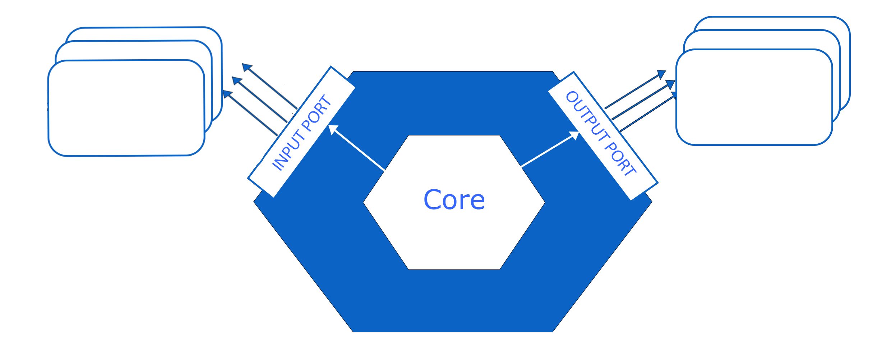

# Base Microservice Archetype

### Introduction
This project uses the [Maven Archetype Plugin](https://maven.apache.org/guides/introduction/introduction-to-archetypes.html)
(v3.1.2) to generate an empty template of a new microservice. It implements the Hexagonal Architecture defined, and has
all the base modules defined in his structure.



### Archetype structure

Bellow is presented the archetype structure with all its modules and source files.

```bash
─── pom.xml
└───src                                                  
    ├───main                                             
    │   └───resources                                    
    │       ├───archetype-resources                      
    │       │   ├─── pom.xml
    |       |   ├───__modulePrefix__-adapter-inbound-kafka
    │       │   │   └───src
    |       |   |       ├───pom.xml                              
    │       │   │       └───main                         
    │       │   │           ├───java                     
    │       │   │           │   └───kafka                 
    │       │   │           │       ├───config           
    │       │   │           │       ├───consumer       
    │       │   │           │       ├───mapper              
    │       │   │           │       ├───model          
    │       │   │           └───resources
    |       |   ├───__modulePrefix__-adapter-inbound-rest
    │       │   │   └───src
    |       |   |       ├─── pom.xml                              
    │       │   │       └───main                         
    │       │   │           ├───java                     
    │       │   │           │   └───rest                 
    │       │   │           │       ├───config           
    │       │   │           │       ├───controller       
    │       │   │           │       ├───dto              
    │       │   │           │       ├───exception        
    │       │   │           │       ├───mapper                   
    │       │   │           └───resources            
                ├───__modulePrefix__-adapter-outbound-nosql
                |       |   |   ├─── pom.xml   
                │       │   │   └───src                              
                │       │   │       └───main                         
                │       │   │           ├───java                     
                │       │   │           │   └───nosql                  
                │       │   │           │       ├───adapter          
                │       │   │           │       ├───config          
                │       │   │           │       ├───constant          
                │       │   │           │       ├───document         
                │       │   │           │       ├───mapper           
                │       │   │           │       └───repository       
                │       │   │           └───resources                 
    │       │   ├───__modulePrefix__-adapter-outbound-sql
    |       |   |   ├─── pom.xml   
    │       │   │   └───src                              
    │       │   │       └───main                         
    │       │   │           ├───java                     
    │       │   │           │   └───sql                  
    │       │   │           │       ├───adapter          
    │       │   │           │       ├───config        
    │       │   │           │       ├───constant        
    │       │   │           │       ├───entity           
    │       │   │           │       ├───mapper           
    │       │   │           │       └───repository       
    │       │   │           └───resources                
    │       │   ├───__modulePrefix__-application    
    |       |   |   ├─── pom.xml        
    │       │   │   └───src                              
    │       │   │       ├───main                         
    │       │   │       │   ├───java                     
    │       │   │       │   └───resources                
    │       │   │       └───test                         
    │       │   │           └───java                     
    │       │   └───__modulePrefix__-core       
    |       |       ├─── pom.xml            
    │       │       └───src                              
    │       │           └───main                         
    │       │               ├───java                     
    │       │               │   └───core                 
    │       │               │       ├───adapter          
    │       │               │       ├───domain           
    │       │               │       └───port             
    │       │               └───resources                
    │       └─── META-INF                                 
    │           └───maven   
    |               └───archetype-metadata.xml                             
    └─── test                                             
        └───resources                                    
            └───projects                                 
                └───basic                                
```

Note that the module names start with an "__modulePrefix__" tag. This tag is one of the archetype input parameters, and
is changed with the parameter input value.

#### Archetype parameters

The existing archetype input values are the following:

| Parameter Name         | Default value |                                 Specifications                                  |
|------------------------|:-------------:|:-------------------------------------------------------------------------------:|
| groupId                | com.once |                              your maven's groupId                               |
| artifactId             | 1nce-project |                             your maven's artifactId                             |
| version                | 0.0.1-SNAPSHOT |                              your maven's version                               |
| package                | com.once.triangleproject |                   the name of the main package in each module                   |
| modulePrefix           | triangle | prefix name of the modules, singular and all lowercase (e.g., order-management) |
| entity                 | Triangle |     name of the entity, singular and first letter uppercase (e.g., "Order")     |

> NOTE:
> To add new, remove or change these parameters names or default values, it's necessary to change the
> __archetype-metadata.xml__, that is inside the META-INF directory.

### Updating the archetype

The existing archetype will need to be maintained by the microservices developers, existing the need to update this
baseline along with the project evolution. Every time that a new component is identified, it should be added to this archetype baseline otherwise 
it will not appear once you create the service from the archetype.

The majority of the information necessary to update this baseline is present in the archetype resources, under the
'archetype-resources' directory.

### Generating a new microservice

There are two different ways of generating a new microservice based on the existing archetype, via command line or
using IntelliJ IDE.

To generate a new microservice using the command line, there is the need first to install the archetype into the local
Maven repository. So, navigate into the archetype root directory, and run:

```bash
mvn install                              
```

After it, you should now have the following archetype in the "__archetype-catalog.xml__" into your local Maven repository.

```xml
    <archetype>
    <groupId>com.nuno.ferreira.commons</groupId>
    <artifactId>archetype</artifactId>
    <version>0.0.1</version>
    <description>base-microservice-archetype</description>
</archetype>
```

#### Command line

Using the command line, and knowing beforehand that the archetype is installed in your local maven repository,
navigate to the directory that you want the new microservice into, and run the following command.

```bash
mvn -B archetype:generate \
  -DarchetypeCatalog=local \
  -DarchetypeGroupId=com.celfocus.jawwy.microservices.commons.archetypes \
  -DarchetypeArtifactId=base-microservice-archetype \
  -DarchetypeVersion=0.0.1-SNAPSHOT \
  -DgroupId=<groupId> \
  -DartifactId=<artifactId> \
  -Dversion=<version> \
  -Dpackage=<Dpackage> \
  -Dentity=<entity> \
  -DmodulePrefix=<modulePrefix> \
  -DmodulePrefixUpperCamel=<DmodulePrefixUpperCamel>
```

> NOTE: If some of the project modules are not necessary to the new microservice generated, it must be removed manually
> from the project structure along with its dependencies.

